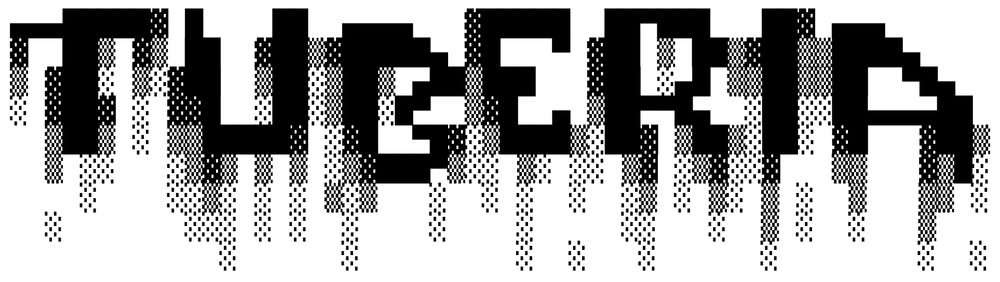

<p align="center">
    <a href="https://aidictive.github.io/tuberia" target="_blank">
        
    </a>
</p>
<p align="center">
    <a href="https://github.com/AIdictive/tuberia/actions/workflows/cicd.yaml" target="_blank">
        
    </a>
    <a href="https://app.codecov.io/gh/AIdictive/tuberia/" target="_blank">
        
    </a>
    <a href="https://github.com/AIdictive/tuberia/issues" target="_blank">
        
    </a>
    <a href="https://github.com/aidictive/tuberia/graphs/contributors" target="_blank">
        
    </a>
    <a href="https://pypi.org/project/tuberia/" target="_blank">
        
    </a>
    <a href="https://pypi.org/project/tuberia/" target="_blank">
        
    </a>
    <br />
    Data engineering meets software engineering
</p>

---

:books: **Documentation**:
<a href="https://aidictive.github.io/tuberia" target="_blank">
    https://aidictive.github.io/tuberia
</a>

:keyboard: **Source Code**:
<a href="https://github.com/aidictive/tuberia" target="_blank">
    https://github.com/aidictive/tuberia
</a>

---


## 🤔 What is this?

Tuberia is born from the need to bring the worlds of data and software
engineering closer together. Here is a list of common problems in data
projects:

* Loooooong SQL queries impossible to understand/test.
* A lot of duplicate code due to the difficulty of reusing it in SQL queries.
* Lack of tests, sometimes because the used framework does not facilitate
testing tasks.
* Lack of documentation.
* Discrepancies between the existing documentation and the latest deployed code.
* A set of notebooks deployed under the Databricks Share folder.
* A generic notebook with utility functions.
* Use of drag-and-drop frameworks that limit the developer's creativity.
* Months of intense work to migrate existing pipelines from one orchestrator to
another (e.g. from Airflow to Prefect, from Databricks Jobs to Data
Factory...).

Tuberia aims to solve all these problems and many others. 


## :nerd_face: How it works?

You can view Tuberia as if it were a compiler. Instead of compiling a
programming language, it compiles the steps necessary for your data pipeline to
run successfully.

Tuberia is not an orchestrator, but it allows you to run the code you write in
Python in any existing orchestrator: Airflow, Prefect, Databricks Jobs, Data
Factory....

Tuberia provides some abstraction of where the code is executed, but defines
very well what are the necessary steps to execute it. For example, this shows
how to create a PySpark DataFrame from the `range` function and creates a Delta
table.

```python
import pyspark.sql.functions as F

from tuberia import PySparkTable, run


class Range(PySparkTable):
    n: int = 10

    def df(self):
        return self.spark.range(self.n)


class DoubleRange(PySparkTable):
    range: Range = Range()

    def df(self):
        return self.range.read().withColumn("id", F.col("id") * 2)


run(DoubleRange())
```

:warning:: Previous code may not work yet and it can change. Please, notice this
project is in an early stage of its development.

All docstrings included in the code will be used to generate documentation
about your data pipeline. That information, together with the result of data
expectations/data quality rules will help you to always have complete and up to
date documentation.

Besides that, as you have seen, Tuberia is pure Python so doing unit tests/data
tests is very easy. Programming gurus will enjoy data engineering again!


## Getting started

You need:

* Spark 3.2.
* Java JDK 11 (Required by Spark).
* [Poetry](https://python-poetry.org/docs/#installation).
* Make.

Once you have all the tools installed just open a shell on the root folder of
the project and install the dependencies in a new virtual environment with:

```sh
$ make install
```

The previous command also installs some [pre-commits](https://pre-commit.com).

Check that your package is installed with:

```sh
$ poetry run tuberia
▄▄▄█████▓ █    ██  ▄▄▄▄   ▓█████  ██▀███   ██▓ ▄▄▄
▓  ██▒ ▓▒ ██  ▓██▒▓█████▄ ▓█   ▀ ▓██ ▒ ██▒▓██▒▒████▄
▒ ▓██░ ▒░▓██  ▒██░▒██▒ ▄██▒███   ▓██ ░▄█ ▒▒██▒▒██  ▀█▄
░ ▓██▓ ░ ▓▓█  ░██░▒██░█▀  ▒▓█  ▄ ▒██▀▀█▄  ░██░░██▄▄▄▄██
  ▒██▒ ░ ▒▒█████▓ ░▓█  ▀█▓░▒████▒░██▓ ▒██▒░██░ ▓█   ▓██▒
  ▒ ░░   ░▒▓▒ ▒ ▒ ░▒▓███▀▒░░ ▒░ ░░ ▒▓ ░▒▓░░▓   ▒▒   ▓▒█░
    ░    ░░▒░ ░ ░ ▒░▒   ░  ░ ░  ░  ░▒ ░ ▒░ ▒ ░  ▒   ▒▒ ░
  ░       ░░░ ░ ░  ░    ░    ░     ░░   ░  ▒ ░  ░   ▒
            ░      ░         ░  ░   ░      ░        ░  ░
Version 0.0.0
```

If you can see that funky logo your installation is correct. Note that the
version may change.

If you do not want to use `poetry run` in front of all your commands just
activate the virtual environment with `poetry shell`. Use `exit` if you want to
deactivate the environment.


## How do I build the package?

You can build the package without installing the dependencies or without a
proper Spark installation. Use `make build` or just `make`. You should see
something like:

```sh
$ make
poetry build
Building tuberia (0.0.0)
  - Building sdist
  - Built tuberia-0.0.0.tar.gz
  - Building wheel
  - Built tuberia-0.0.0-py3-none-any.whl
```


## How do I run tests?

Run tests locally with:

```sh
$ make test
```


## Contribution guidelines

* The code is auto-formatted by Black, so you can write the code without
following any style guide and Black will take care of making it consistent
with the current codebase.
* Write tests: test not added in the PR, test that will never be added.
