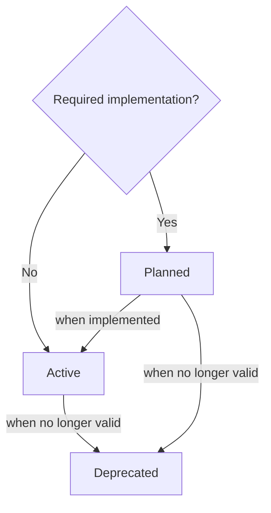

# TEP 0 - Tuberia Enhancement Proposals


{{
    tep_header(
        authors=["guiferviz"],
        status="Active",
        created="2022-11-14",
        version="0.0.1",
    )
}}

This first TEP introduces TEPs. Here we define what TEPs are, what process
should be followed to propose one and what information they should contain.

## What is a TEP?

TEP stands for Tuberia Enhancement Proposal. A TEP is a design document
providing information to the Tuberia community, or describing a new feature for
Tuberia or its processes or environment. TEP is to Tuberia what PEP is to
Python. In fact, the first two sentences of this paragraph are an adaptation of
the first lines of [PEP 1](https://peps.python.org/pep-0001/)
:slightly_smiling_face:.

## Creation process

At the moment, the creation process is very simple:

1. Create a new file inside `docs/teps`. The number of the new TEP should be
chosen by adding 1 to the last existing TEP.
2. Copy the header macro of this TEP and update the different values. Learn how
to set the status in the following flow diagram.
3. Write the document. See more about this point in the following section.
4. Publish a PR to start the review/discussion.

Flow diagram that defines how to set an status:

## What a TEP should contain?

TEP files should be written in a friendly way, without assuming too much
knowledge on the part of the reader. It is a technical document, but technical
terms should not be abused.

They do not require a common structure, just make sure it is comprehensible.
Include an abstract after the metadata table at the beginning and organise the
article into sections of your choice.
