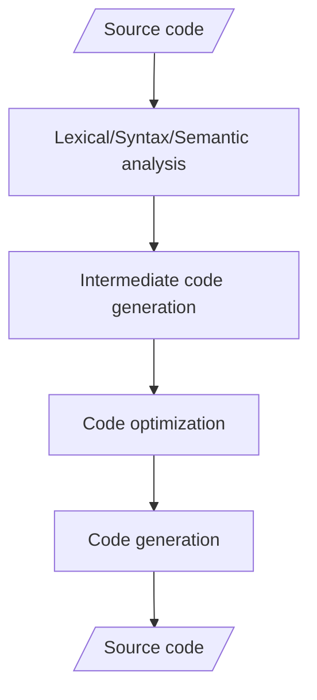
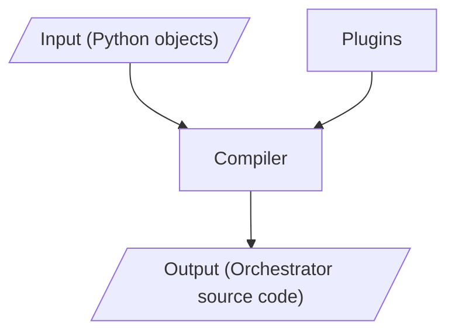
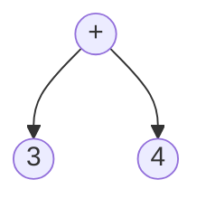
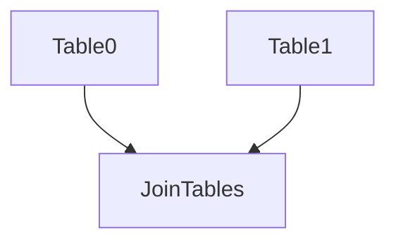

# TEP 1 - A pipeline compiler


{{
    tep_header(
        authors=["guiferviz"],
        status="Planned",
        created="2022-12-08",
        version="0.0.1",
    )
}}

We want Tuberia to be a pipeline compiler. A typical programming language
compiler translates from a source code into a different source code (usually
machine code, code that can be executed by the CPU of the platform that we are
using). We can divide a compiler in different phases:

<figure>

<figcaption>Compiler phases</figcaption>
</figure>

In the case of Tuberia, the compiler phases would be similar, but instead of
working with source code, it would work with Python objects representing
pipelines. The compiler would have to analyze the objects and their
relationships to build an intermediate representation, such as an AST or a DAG,
and then generate code that can be executed by a specific orchestration tool,
such as Airflow or Prefect. This code would define the steps and dependencies
of the data pipeline, and would be executed by the chosen orchestration tool to
run the data pipeline.

In this TEP we will discuss the high-level design of the Tuberia compiler. In
future TEPs we will elaborate on each of the compiler elements defined here.
The goal of this TEP is to provide a high-level overview of the proposed design
of the Tuberia compiler, and to spark discussion and feedback on the direction
and potential of Tuberia.


## Elements of a pipeline compiler

Like any other computer program, a pipeline compiler such as Tuberia must have
inputs and outputs. The compilation process can also be divided into certain
phases. So far these are the phases we have identified

<figure>

<figcaption>Tuberia key elements</figcaption>
</figure>

Each of these phases will be described in more detail below.


### Inputs

The inputs of a classical code compiler are source code files. A code compiler
reads the text in these files and converts it into an abstract syntax tree
(AST). For example, an AST of `3 + 4` is:

<figure markdown>

<figcaption markdown>AST of `3 + 4`</figcaption>
</figure>

In the case of Tuberia we do not want to reinvent the wheel and design a new
language, but we want to reuse the existing ones. Specifically Python, one of
the most widespread languages in the world of data. The input to the compiler
would be Python objects representing steps in the pipeline, rather than source
code files. Python is a widely-used and well-known language, many developers
are already familiar with it, which means they can start using Tuberia without
a steep learning curve. Additionally, Python has a rich ecosystem of libraries
and tools (pandas, pyspark, polars...) that can be used in conjunction with
Tuberia to build powerful data pipelines.

Tuberia will not create an AST itself, but it will create a DAG (Directed
Acyclic Graph) in which each node will be an indivisible unit of work. For
example, look at the following code:

```python
class Table0:
    def create(self):
        # Create table 0 here.

class Table1:
    def create(self):
        # Create table 1 here.

class JoinTables:
    table0: Table0
    table1: Table1

    def create(self):
        # Create a combined table using table 0 and table 1.
```

The previous code can be depicted as follows:

<figure markdown>

<figcaption markdown>
In this example each unit of work creates a table. JoinTables needs from Table0
and Table1, in other words, JoinTables depends on Table0 and Table1.
</figcaption>
</figure>

The dependencies between each of the tables is described in the class
definition. Table0 and Table1 do not contain any references to other classes,
so they do not depend on any previous step. JoinTables do contain two
references to other classes, so it is implicit that they depend on them to be
created.

This structure of interrelated objects will be the "source code" of Tuberia
compiler.


### Compiler

The Tuberia compiler is responsible for analyzing the input Python objects and
generating intermediate code, optimizing the code, and finally generating
orchestrator source code. This process is similar to that of a typical
compiler, but it works with Python objects representing data pipelines instead
of source code. The compiler uses plugins to support different orchestration
tools, allowing users to generate code for the tool of their choice.

A **orchestrator target** in Tuberia is the type of orchestrator for which the
compiler will generate code. For example, a user could specify that they want
to generate code for Airflow, in which case the compiler would use the
appropriate plugin to generate the code in the correct format for Airflow. This
allows users to choose the orchestrator that best fits their needs and use
Tuberia to easily generate code for it.

Apart from a target orchestrator we need to define the target executor. For
example, if you are creating PySpark transformations that you want to run in
Databricks from Airflow you need to differentiate between the target
orchestrator (Airflow) and the target executor (Databricks). The **target
executor** is the environment in which each of the steps of our pipeline will
be executed, such as Databricks or a local Spark cluster. This information is
used by the compiler to generate the orchestrator code that is compatible with
the specified executor, allowing users to easily run their pipelines in the
desired environment.

To continue with the previous example, the generated Airflow DAG will make use
of [Databricks
Operators](https://airflow.apache.org/docs/apache-airflow-providers-databricks/stable/operators/index.html)
if the execution target is Databricks. If the execution target is Python, a
[Python
Operator](https://airflow.apache.org/docs/apache-airflow/stable/howto/operator/python.html)
could be used.


### Plugins

Plugins are used in Tuberia to support different orchestrators and executors.
Each plugin is responsible for generating code that is compatible with a
specific orchestrator or executor. This allows users to easily generate code
for the tool of their choice, without needing to worry about the specifics of
the target platform. Plugins also make it easy for developers to add support
for new orchestrators or executors to Tuberia, allowing the tool to be used
with a wide range of platforms.

In addition to generating code, plugins in Tuberia can also modify the
intermediate representation of the pipeline (the DAG) to add additional
functionality or features. For example, a plugin could wrap existing steps with
logging or error handling. By allowing plugins to modify the intermediate
representation, Tuberia can be extended and customized to support a wide range
of functionality and use cases.

A plugin could analyze the DAG and merge multiple tasks into a single task if
it knows that doing so would be more efficient. By allowing plugins to optimize
the generated code, Tuberia can help users to create more efficient and
performant data pipelines.


### Outputs

The outputs of Tuberia are source code files that can be executed by the chosen
orchestrator. The exact format of these files will depend on the target
orchestrator. For example, if the user has chosen to generate code for Airflow
to run on a Databricks cluster, the output of Tuberia will be a Python file
containing the Airflow DAG. On the other hand, if the target orchestrator was a
Databricks Multi-Step job, a JSON file that you can use to send to the
Databricks API will be generated.

Tuberia is designed to generate code that can be manually deployed by the user
( or automated in the user CI/CD pipeline), but this behavior is not specified
in this TEP. In general, deployment of generated code is a separate process
from code generation and is not typically handled by Tuberia itself. We will
probably introduce this feature in the future.


## Example

Here is an example of how Tuberia might be used to compile a data pipeline in
Python. First, we define some Python classes representing steps in our
pipeline. For example:

```python
class ExtractData:
    def run(self):
        # Extract data from a database and save it to a staging table.

class TransformData:
    extract_data: ExtractData

    def run(self):
        # Transform the data using a specific set of rules and save the output
        # into another staging table.

class LoadData:
    transform_data: TransformData

    def run(self):
        # Create some KPIs and load the transformed data into a data warehouse.
```

Next, we use Tuberia to compile these classes into code that can be executed by
an orchestrator. We specify the target orchestrator and executor, such as
Airflow and Databricks, and use the appropriate plugin to generate the code.
This is the proposed syntax for doing so, although it is not yet implemented:

```python
# Define the target orchestrator and executor.
orchestrator = "airflow"
executor = "databricks"

# Compile the pipeline using Tuberia.
code = tuberia.compile(LoadData, orchestrator, executor)
```

Once the Tuberia compiler has generated the code for the data pipeline, it is
up to the user to decide what to do with it. The generated code can be deployed
to the target orchestrator and executed to run the pipeline, or it can be
modified or extended by the user as needed. It is important to note that the
generated code may not always work, and the user may need to make additional
changes or adjustments in his/her infrastructure to get it working as desired.
For example, if the generated code is using an Airflow operator that is not
installed in your Airflow environment you will get error if you try to execute
the generated code.


## Advanced usage

In addition to being able to generate code for the pipeline, having access to
the DAG representation of the pipeline can also provide other advantages. For
example, you can use the DAG to **generate documentation** for the pipeline,
which can be useful for other members of your team who need to understand the
pipeline's structure and dependencies.

Additionally, the DAG can be used to generate extra steps in your pipelines,
such as checking the schema of the data being processed match the expected one
or checking the quality of the data to ensure that it meets certain criteria.

By leveraging the DAG representation of the pipeline, Tuberia can help users to
create more robust and well-documented data pipelines.


## Conclusion

Overall, the design of a data pipeline using Tuberia would involve creating
Python objects representing pipeline steps, using a compiler to generate code
or configuration files for the target orchestrator. This design would allow
users to easily define and deploy data pipelines using Python objects, without
having to manually write code or configuration files for the target
orchestration platform.

This TEP is an initial proposal for the design of the Tuberia compiler, and it
is subject to change and modification. The ideas and concepts presented in this
TEP are intended to serve as a starting point for discussion and further
development, and are not intended to be definitive or final. As such, it is
possible that some of the ideas and proposals in this TEP may be refined,
expanded upon, or even removed in future TEPs.
