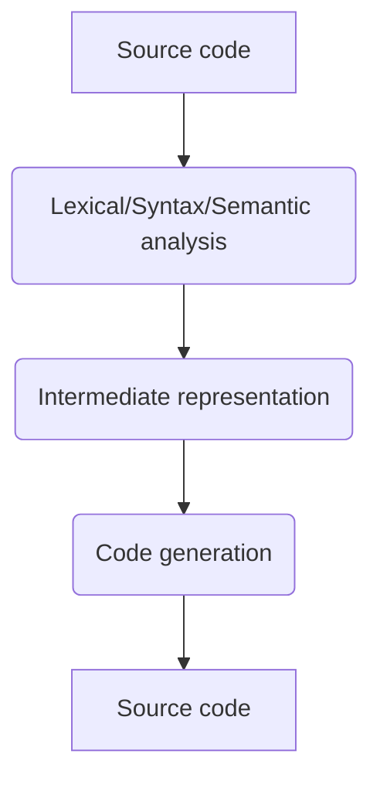
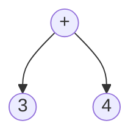
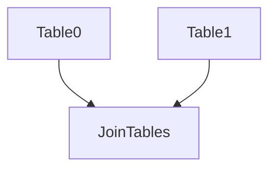
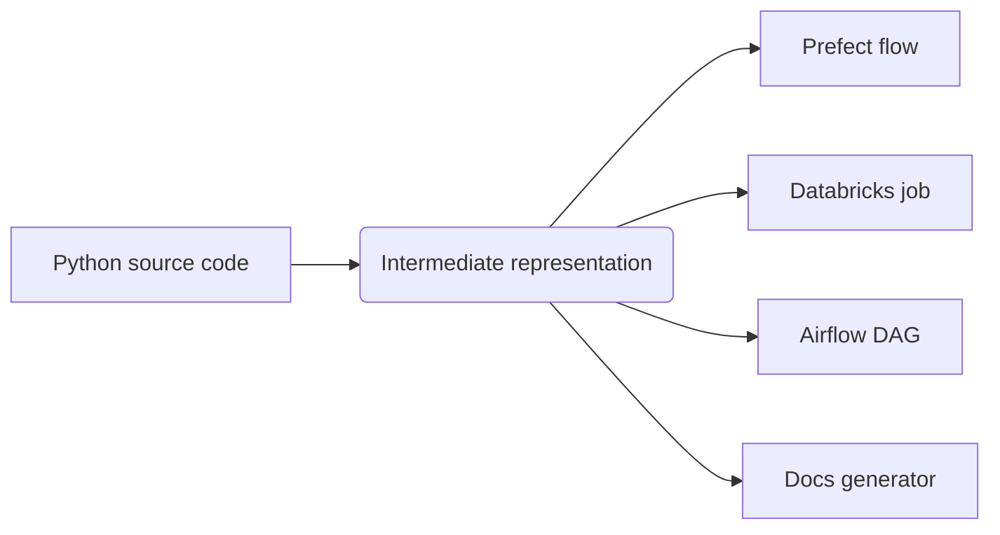

# TEP 1 - Flexible and simple tasks


{{
    tep_header(
        authors=["guiferviz"],
        status="Planned",
        created="2022-11-14",
        version="0.0.1",
    )
}}

We want Tuberia to be a pipeline compiler. A typical programming language
compiler translates from a source code into a different source code (usually
machine code, code that can be executed by the CPU of the platform that we are
using). We can divide the compiler phases in this 3:

<figure>

<figcaption>Compiler phases</figcaption>
</figure>

According to [Wikipedia](https://en.wikipedia.org/wiki/Intermediate_representation):

!!! quote

    An intermediate representation (IR) is the data structure or code used
    internally by a compiler or virtual machine to represent source code.

A code compiler reads text and converts it into an abstract syntax tree (AST).
For example, an AST of `3 + 4` is:

<figure markdown>

<figcaption markdown>AST of `3 + 4`</figcaption>
</figure>

Tuberia will not create an AST itself, but it will create a dependency tree in
which each node will be an indivisible unit of work. For example:

<figure markdown>

<figcaption markdown>In this example each unit of work creates a table. JoinTables needs from Table0 and Table1, in other words, JoinTables depends on Table0 and Table1.</figcaption>
</figure>

In this TEP we present how the different tasks will be defined and how this
dependency tree will be created from those tasks.


## Name selection

How you call things is very important in computing, so in this section we will
discuss **how we are going to call the indivisible units of work** that are
going to be the nodes of our dependency tree.

Task was the first that came to my mind, but I have also thought of Step. Task
is more common in computer science, there is not doubt about that. But what is
the difference between these two terms?

I like the definitions provided by [this
page](https://www.pie.me/blog/task-versus-step){target=_blank}.

!!! quote

    A step is part of a group. A task is alone. A step wants to feel like it
    belongs to a bigger purpose, contributing to others. A task is selfish,
    only thinking of itself.

It does not mean that the tasks are totally independent and do not need each
other, just that their name indicates that they can run on their own. It could
be the case that our data pipeline only requires the creation of one table, so
it can be implemented with a single task. Step seems to imply that there is
always more than one, one in a series. Having a process with only one step
makes the step definition meaningless.

Based on this definition, and without wishing to introduce new terms that could
lead to confusion, we will use Task to define our smaller work units.


## Existing libraries

There are several libraries that define a Python Task class. Why not reusing
one of those for building our dependency tree?

Prefect is the library for creating
[tasks](https://docs-v1.prefect.io/api/latest/core/task.html#task){target=_blank}
which I am most familiar with. Here is an example of how to create an use a
task. In this example we are also creating a prefect Flow, equivalent to the
dependency tree that we also want to define in this TEP.

```python
from prefect import Task


class AddTask(Task):
    def run(self, x, y):
        return x + y

a = AddTask()

with Flow("My Flow") as f:
    t1 = a(1, 2) # t1 != a
    t2 = a(5, 7) # t2 != a
```

The least convincing part of this implementation is that the parameters that
define the execution are passed to the run method. You can create an `__init__`
method in your Task subclass but the parameters you pass to it must be any
other type of data than Task objects. It's quite confusing to have 2 different
ways to pass parameters to your task. I would prefer all parameters in the
`__init__` method.

Prefect also comes with decorators.

```python
from prefect import task

@task
def add_task(x, y):
    return x + y
```

For simple tasks this may be fine, but most of the time we will have a lot of
parameters. Think about PySpark table creation; we must have the database name,
the table name, the input tables, the data expectations we must apply, the
table schema... We can subclass from Task and create a PySparkTable class with
all those common table parameters and then create a decorator that creates tables
using the PySparkTable class. Pseudocode:

```python
from prefect import task

class PySparkTable(Task):
    ...

# Define decorator
def pyspark_table(...):
    ...

@pyspark_table(
    database_name="my_database",
    table_name="my_table",
    data_expectations=...
    schema=...
)
def join_tables(table0, table1):
    # Create table from tables table0 and table1.
    ...
```

Again, same problem as before, the parameters passed to the decorator are
indeed passed to the `__init__` method. The function parameters are `run`
method parameters. Task dependencies cannot be passed to `__init__`, just to
`run`. Apart from that, it is not possible to get the database_name or
table_name from the function body, which make this approach difficult to use.

There is one observation more, imagine that we have two functions `table0` and
`table1` decorated with our `pyspark_table` decorator. We need to save those
tables in a variable in order to pass them to the `join_tables` task:

```python
@pyspark_table
def table0():
    ...

@pyspark_table
def table1():
    ...

@pyspark_table
def join_tables(table0, table1):
    ...

with Flow("My Flow") as f:
    table0 = table0()
    table1 = table1()
    join_tables = join_tables(table0, table1)
```

Do you see any problem in the previous code? We are naming our functions using
the name of the tables. It makes sense to create variables with exactly the
same names, but it is a problem as we are overwriting the functions. In this
example it is not clear if we are passing `table0` and `table1` functions to
our join_tables or if we are passing the task objects.

There are more issues with this approach. Just looking at `join_tables`, what
can we say about `table0`? Can we use any pyspark table here or it should have
a concrete schema? Using decorators we loose type annotations. If we create
classes we have a type that we can use to annotate parameters. Besides that, we
can easily name the variables. For example:

```python
class Table0(PySparkTable):
    ...

class Table1(PySparkTable):
    ...

class JoinTables(PySparkTable):
    table0: Table0
    table1: Table1

    def __init__(self, table0: Table0, table1: Table1):
        self.table0 = table0
        self.table1 = table1

    def run(self):
        ...
```

The previous code does not work in Prefect because we are using tasks as class
attributes but we can see that this approach provides typing annotations and
avoids name collisions (`Table0` can now be assigned to `table0` without
hiding any function).

!!! note

    On the other hand, Prefect requires a lot of dependencies, so if it can be
    avoided, the better.

I could not find more libraries following an approach similar to what I have in
mind. I did explore [invoke](https://github.com/pyinvoke/invoke) but it is more
related to `make` than to Prefect. [celery](https://github.com/celery/celery)
deals with distributed tasks.


# Conclusion


